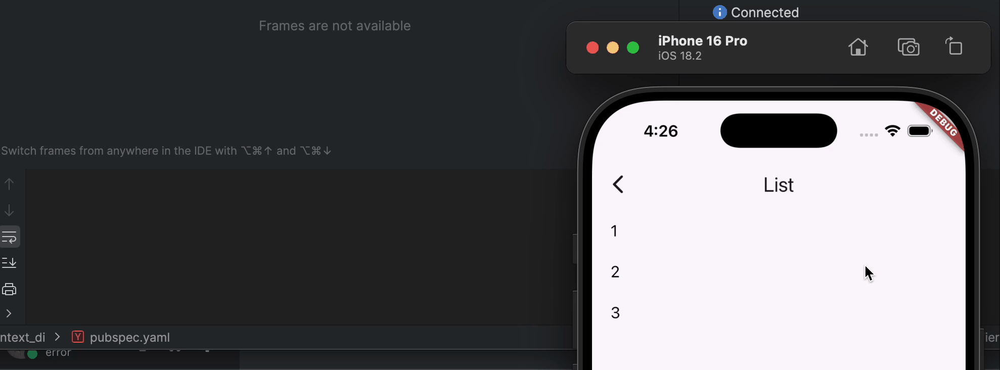

<!--
This README describes the package. If you publish this package to pub.dev,
this README's contents appear on the landing page for your package.

For information about how to write a good package README, see the guide for
[writing package pages](https://dart.dev/tools/pub/writing-package-pages).

For general information about developing packages, see the Dart guide for
[creating packages](https://dart.dev/guides/libraries/create-packages)
and the Flutter guide for
[developing packages and plugins](https://flutter.dev/to/develop-packages).
-->
[](https://pub.dev/packages/context_di)
Project is based on [Provider](https://pub.dev/packages/provider) package.
Main goal is to create a tool that will help reduce boilerplate code and
make it easier to work with dependency injection via Provider.

## Features
2 scopes are supported:
- factory scope (creates instance every time)
- singleton scope (one instance per feature)

Parameterized factories
```dart
final bloc = context.resolveWithParams<Bloc>((id: _id));
```

Scopes based on widget tree lifecycle:


## Getting started
Create a feature class that extends `FeatureDependencies` and override `register` method.
When you need to register a dependency, use `registerSingleton`, `registerSingletonAs`, `registerFactory` or `registerParamsFactory` methods.

```dart
typedef EntityBlocParams = ({int id});

class BasicFeature extends FeatureDependencies {
  const BasicFeature({super.key, super.builder});

  @override
  List<Registration> register(BuildContext context) {
    return [
      registerSingletonAs<Repository, RepositoryInterface>(
        (context) => Repository(context.resolve()),
        dispose: (context, instance) => instance.dispose(),
      ),
      registerFactory(
        (context) => ListBloc(context.resolve<RepositoryInterface>()),
      ),
      registerParamsFactory(
        (context, EntityBlocParams params) => EntityBloc(
          params.id,
          context.resolve(),
        ),
      ),
    ];
  }
}
```

Add to your widget tree
```dart
@RoutePage()
class BasicFeaturePage extends StatelessWidget {
  const BasicFeaturePage({super.key});

  @override
  Widget build(BuildContext context) {
    return BasicFeature(builder: (context) {
      return _Content();
    });
  }
}
```

And resolve dependencies in feature co
```dart
class _Content extends StatefulWidget {
  const _Content();

  @override
  State<_Content> createState() => _ContentState();
}

class _ContentState extends State<_Content> {
  late final ListBloc _listBloc;

  int? _selectedId;

  @override
  void initState() {
    _listBloc = context.resolve<ListBloc>();
    super.initState();
  }

  @override
  void dispose() {
    _listBloc.close();
    super.dispose();
  }

  //...
}
```
```dart
@RoutePage()
class EntityPage extends StatelessWidget {
  final int _id;

  const EntityPage({super.key, required int id}) : _id = id;

  @override
  Widget build(BuildContext context) {
    return BlocProvider<EntityBloc>(
      create: (_) => context.resolveWithParams((id: _id)),
      child: BlocBuilder<EntityBloc, EntityState>(builder: (context, state) {
        return Scaffold(
          body: switch (state) {
            Initial() => Center(child: CircularProgressIndicator.adaptive()),
            Loaded() => _Content(state),
          },
        );
      }),
    );
  }
}
```

basic resolve
```dart
 final listBloc = context.resolve<ListBloc>();
```

parametrized resolve
```dart
 var create = (_) => context.resolveWithParams((id: _id));
```

## Additional information

IMPORTANT NOTICE! You can use `resolve` or `resolveWithParams` only in feature context, in lover levels of widget tree.
If you have some core dependencies register them on app level:
```dart
class MyApp extends StatelessWidget {
  MyApp({super.key});

  final _router = AppRouter();

  @override
  Widget build(BuildContext context) {
    return _RootDependencies(
      builder: (context) => MaterialApp.router(
        title: 'Flutter Demo',
        theme: ThemeData(
          colorScheme: ColorScheme.fromSeed(seedColor: Colors.deepPurple),
          useMaterial3: true,
        ),
        routerConfig: _router.config(),
      ),
    );
  }
}

class _RootDependencies extends FeatureDependencies {
  const _RootDependencies({super.builder});

  @override
  List<Registration> register(BuildContext context) {
    return [
      registerSingleton<Logger>((_) => Logger()),
    ];
  }
}
```

